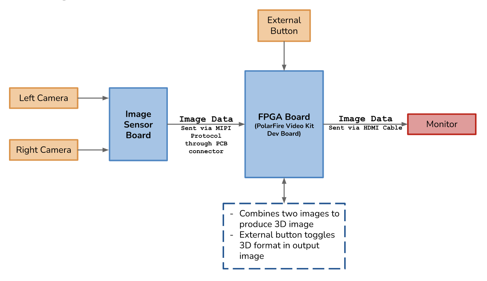

Our goal is to build a camera that can capture and process surgical microscope images to be directly visualized in 3D.
### Abstract
Viewpointe ties into Alcon’s Ngenuity visualization system, working to collect stereo images from a microscope used by surgeons during cataract operations. Using an FPGA, the two image inputs will be processed into a display form suitable for a 3D monitor. The user will have the ability to choose between visual formats, including side-by-side, top-bottom, and traditional intersampled mosaic. The input type will also support both HDMI and DisplayPort. All processing will happen on the camera itself, without requiring an external computer. By bypassing Ngenuity’s host computer, our hope is to decrease latency and end user costs.

### Block Diagram

