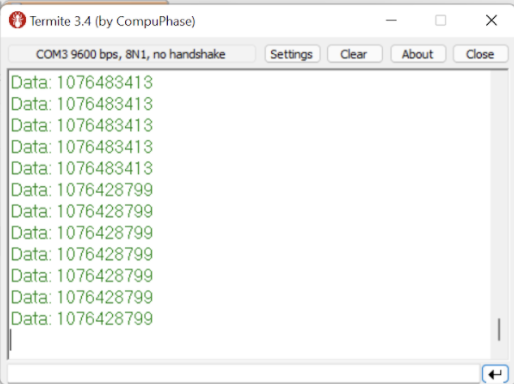

[Home](https://kthanigaivelan.github.io/ece_153b_project/)
[Parts](https://kthanigaivelan.github.io/ece_153b_project/parts)
**[Updates](https://kthanigaivelan.github.io/ece_153b_project/updates)**

### Weekly Updates
**02/25:**
We bought the LIFX Smart Lamp and worked on interfacing with the LIFXLAN library to control the lamp with Python. We also worked on setting up the BH1750 sensor using I2C protocols, by pseudocoding all the functions (init, reset, mode set, read data, etc) and understanding the commands taken by the sensor. We referenced Lab 4's I2C setup to do this. We will also be ordering the motion sensor.

**03/04:**
We were successful in implementing the function necessary to set up the BH1750 sensor. It now reads the correct lux values, which we tested by using different levels of light from a phone flashlight. We used a serial connection to output this in Termite. We attempted to do the same using the Bluetooth module, but ran into problems with the use of pins for UART communication. We will look into this next week. We have ordered the motion sensor, and will be working on implementing PyBluez and LifxLAN libraries in Python in order to communicate with the lamp.

**03/11:**
We realized there was a conflict in our I2C pins and UART pins, so we reassigned the pins for our brightness sensor. We thought that our bluetooth module was broken, but after attending office hours we were able to have the module transmit the ambience data. We also worked on the Python interfacing with the Bluetooth, and are working on transmitting this to the smart bulb.

**03/15:**
We decided to scrap the motion detector trigger, since the range of the sensor we had intended on using was too sensitive to successfully demo it. We set up the Python script to output the current bulb lux value and control the bulb itself using the LifxLan API and PySerial. Finishing touches were made to the website, including the demonstration video.
